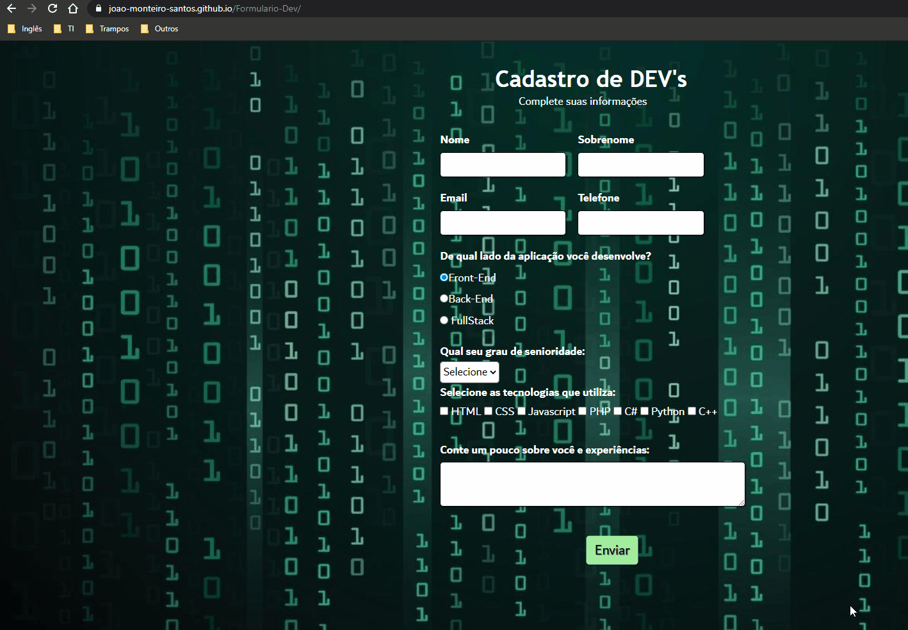

## Formulário de Cadastro de Desenvolvedores

Projeto criado somente em HTML e CSS, onde faço um formulário para cadastro de desenvolvedores.

### 🛠 Tecnologias

As seguintes ferramentas foram usadas na construção do projeto:

- HTML
- CSS

<h4 align="center"> 
	:computer: Projeto concluído :heavy_check_mark:
</h4>

*Link do projeto:* https://jvmsantos13.github.io/Formulario-Dev/

## Autor
João Victor Monteiro  
https://www.linkedin.com/in/jvmsantos/
